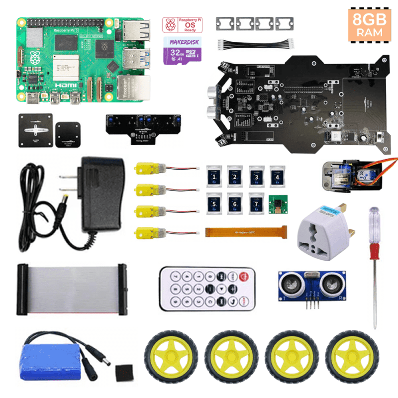
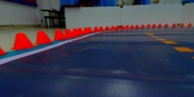
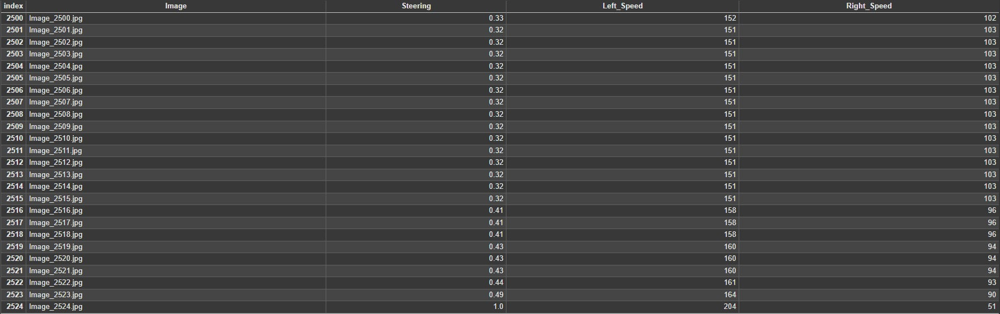

# Auto Car Simulator For Road Simulator With Dodge and Stop

This project has developed an autonomous vehicle simulation vehicle for simulated roads that can avoid and stop cars.

## Description

This project focuses on developing an autonomous driving simulation vehicle for simulated roads that can avoid obstacles and stop the car automatically, using artificial intelligence (AI) technology to increase safety and reduce accidents on the road.

The developed system consists of Raspberry Pi, which controls the operation of two webcams and ultrasonic sensors. The webcams are used to detect the path and objects in front, processed through the MobileNet model for tracking the path, and YOLO for detecting objects, to ensure accurate data analysis.

In addition, the system can also estimate the distance from the ultrasonic sensor, which is used to slow down and stop the car automatically when there is an object in front.

## Hardware

  

  * 1 x Raspberry Pi 5 Mainboard
  * 1 x Raspberry Pi AI HAT+ 13 TOPS
  * 1 x 32GB MakerDisk microSD card preloaded with Raspbot OS
  * 1 x Car Expansion Board
  * 1 x Camera Platform PCB
  * 1 x PTZ Component
  * 4 x Tire
  * 4 x Motor Fixing Frame
  * 1 x Four-channel Tracking Module with 6-pin Cable
  * 4 x Motor
  * 1 x Battery and Velcro
  * 1 x 40-pin Cable
  * 1 x Camera with Cable
  * 1 x Ultrasonic Sensor
  * 1 x Remote Control
  * 1 x Screwdriver
  * 1 x 12.6V Charger 
  * 1 x UK Plug Universal Adapter 
  * 7 x Screw Pack
  * 1 x Manual
  * 2 x Webcam
  

  You can view the parts on this website [Click here](http://www.yahboom.net/study/Raspbot)

## Programming

The main programming language of the project is Python, used on Raspberry Pi 5. For capturing and processing images, as well as computer vision algorithms, the OpenCV library is used, and ultrasonic sensors are used 
to measure distances to control the motors to stop and avoid.

  ### Collecting datasets for training and building models
  
  
  Collecting images of simulated roads and motor speed values. When the Data Collection Main.py code is run, it will connect to other modules. It will use a joystick to control the speed and movement of the car. It will save 240 x 120 images and data as .csv and use it to train the model to make the car move automatically.

