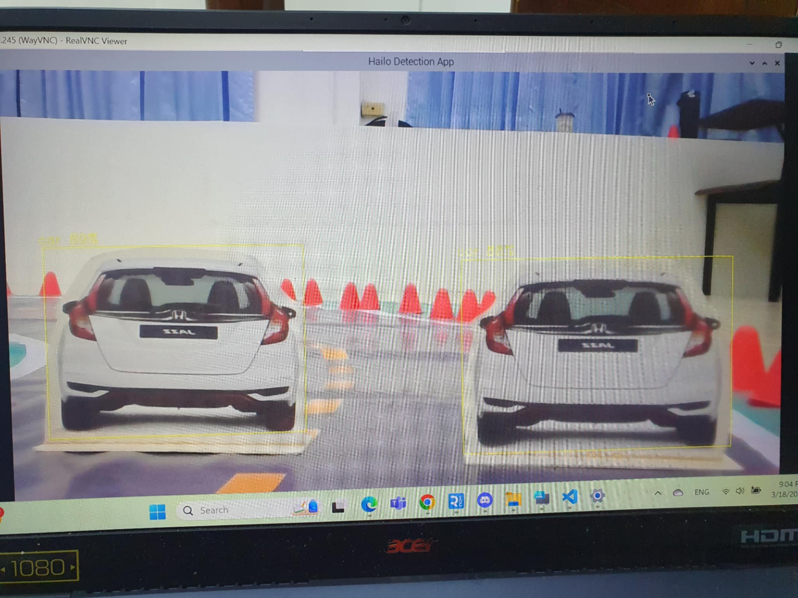

# Auto Car Simulator For Road Simulator With Dodge and Stop

This project has developed an autonomous vehicle simulation vehicle for simulated roads that can avoid and stop cars.

## Description

This project focuses on developing an autonomous driving simulation vehicle for simulated roads that can avoid obstacles and stop the car automatically, using artificial intelligence (AI) technology to increase safety and reduce accidents on the road.

The developed system consists of Raspberry Pi, which controls the operation of two webcams and ultrasonic sensors. The webcams are used to detect the path and objects in front, processed through the MobileNet model for tracking the path, and YOLO for detecting objects, to ensure accurate data analysis.

In addition, the system can also estimate the distance from the ultrasonic sensor, which is used to slow down and stop the car automatically when there is an object in front.

## Hardware

  

  * 1 x Raspberry Pi 5 Mainboard
  * 1 x Raspberry Pi AI HAT+ 13 TOPS
  * 1 x 32GB MakerDisk microSD card preloaded with Raspbot OS
  * 1 x Car Expansion Board
  * 1 x Camera Platform PCB
  * 1 x PTZ Component
  * 4 x Tire
  * 4 x Motor Fixing Frame
  * 1 x Four-channel Tracking Module with 6-pin Cable
  * 4 x Motor
  * 1 x Battery and Velcro
  * 1 x 40-pin Cable
  * 1 x Camera with Cable
  * 1 x Ultrasonic Sensor
  * 1 x Remote Control
  * 1 x Screwdriver
  * 1 x 12.6V Charger 
  * 1 x UK Plug Universal Adapter 
  * 7 x Screw Pack
  * 1 x Manual
  * 2 x Webcam
  

  You can view the parts on this website [Click here](http://www.yahboom.net/study/Raspbot)

## Programming

The main programming language of the project is Python, used on Raspberry Pi 5. For capturing and processing images, as well as computer vision algorithms, the OpenCV library is used, and ultrasonic sensors are used 
to measure distances to control the motors to stop and avoid.

  ### Dataset collection for training and modeling of autonomous vehicles
  
  
  Collecting images of simulated roads and motor speed values. When the Data Collection Main.py code is run, it will connect to other modules. It will use a joystick to control the speed and movement of the car. It will save 240 x 120 images and data as .csv and use it to train the MobileNetV2 model. It will receive images from the camera, process them and predict the motor speed values ​​to make the car move automatically and convert the model to .tflite format to make the model smaller, work faster, reduce latency but may reduce accuracy.

  ### OpenCV Installation on Raspberry Pi 5
  ```bash
  1. sudo apt-get update && sudo apt-get upgrade && sudo rpi-update
  2. sudo nano /etc/dphys-swapfile
    CONF_SWAPSIZE=2048
  3. sudo apt-get install build-essential cmake pkg-config
  4. sudo apt-get install libjpeg-dev libtiff5-dev libjasper-dev libpng12-dev
  5. sudo apt-get install libavcodec-dev libavformat-dev libswscale-dev libv4l-dev
  6. sudo apt-get install libxvidcore-dev libx264-dev
  7. sudo apt-get install libgtk2.0-dev libgtk-3-dev
  8. sudo apt-get install libatlas-base-dev gfortran
  9. wget -O opencv.zip https://github.com/opencv/opencv/archive/4.1.0.zip
  10. wget -O opencv_contrib.zip https://github.com/opencv/opencv_contrib/archive/4.1.0.zip
  11. unzip opencv.zip
  12. unzip opencv_contrib.zip
  13. sudo pip3 install numpy
  14. cd ~/opencv-4.1.0/
  15. mkdir build
  16. cd build
  17. cmake -D CMAKE_BUILD_TYPE=RELEASE \
    -D CMAKE_INSTALL_PREFIX=/usr/local \
    -D INSTALL_PYTHON_EXAMPLES=ON \
    -D OPENCV_EXTRA_MODULES_PATH=~/opencv_contrib-4.1.0/modules \
    -D BUILD_EXAMPLES=ON ..
  18. make -j4
  19. sudo make install && sudo ld
  ```

  ### Install Hailo Hardware and Software Setup on Raspberry Pi

  This project uses yolov8n model to detect the capabilities of the Hailo AI processor on the Raspberry Pi 5, allowing you to run AI on embedded devices, and is designed to work with the Raspberry Pi AI Kit and AI HAT, which support both the Hailo8 (26 TOPS) and Hailo8L (13 TOPS) AI processors.
  
  The AI ​​HAT+ comes with a ribbon cable, GPIO stack header and mounting hardware. Then connect it to your Raspberry Pi 5 and follow these steps:
  1. First, ensure that your Raspberry Pi  5 runs the latest software. Run the following command to update:
     ```bash
     sudo apt update && sudo apt full-upgrade
      ```
  2. Install the drivers and software required to run AI HAT+.
      ```bash
     sudo apt install hailo-all
      ```
  3. Install Hailo RPi5 Basic Pipelines
     #### Clone the Repository
     ```bash
     git clone https://github.com/hailo-ai/hailo-rpi5-examples.git
      ```
     Navigate to the repository directory:
     ```bash
     cd hailo-rpi5-examples
      ```
     #### Installation
     Run the following script to automate the installation process:
     ```bash
     ./install.sh
      ```
     #### Running The Code with USB camera input (webcam):
     When opening a new terminal session, ensure you have sourced the environment setup script:
     ```bash
     source setup_env.sh
      ```
     Detect the available camera using this script:
     ```bash
     get-usb-camera
      ```
     Run example using USB camera input - Use the device found by the previous script:
     ```bash
     python basic_pipelines/detection.py --input /dev/video<X>
      ```
     Example:
     ```bash
     python basic_pipelines/Autonomous.py --input /dev/video1
     ```

     ```bash
     python basic_pipelines/Detection.py --input /dev/video2
     ```
     
     

     
